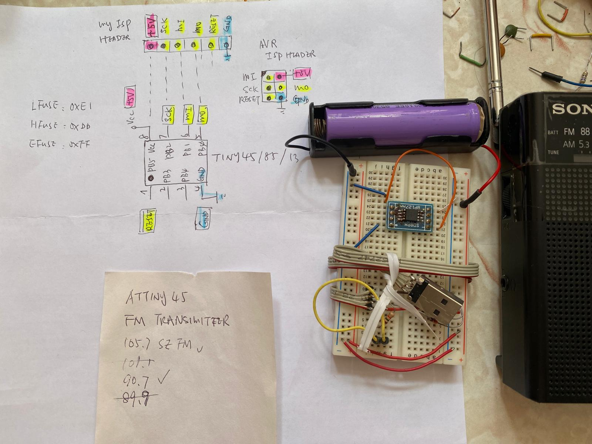
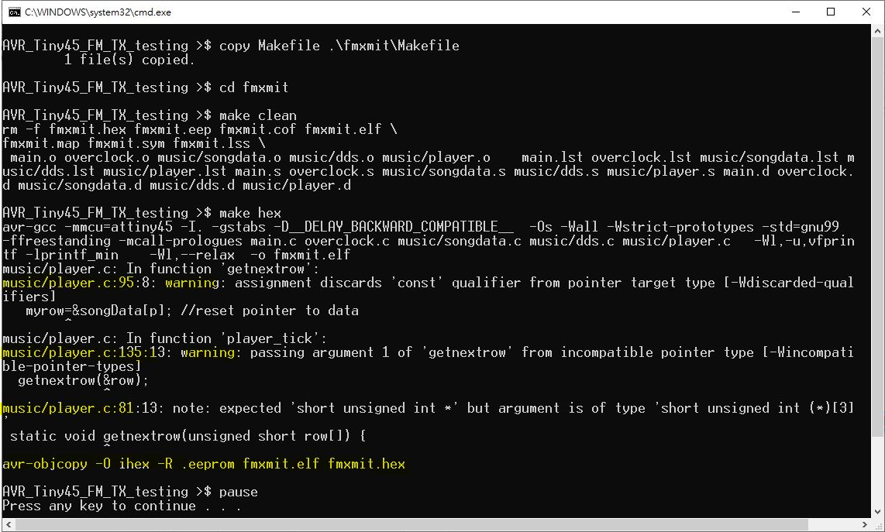
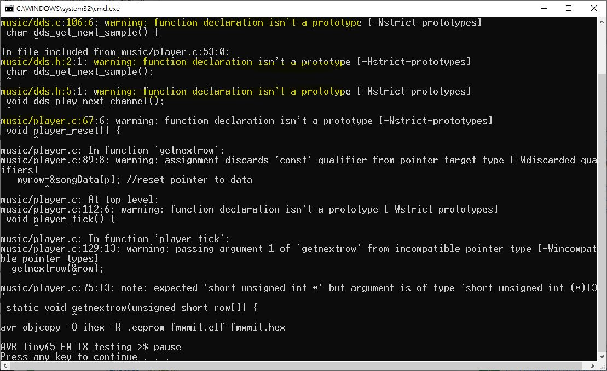
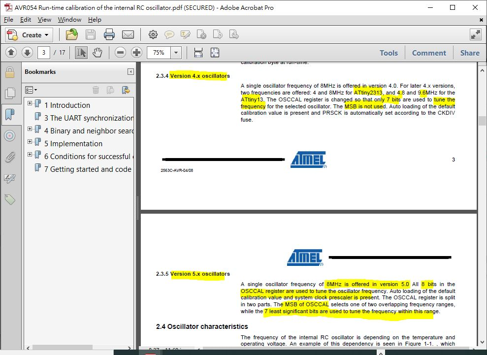

# AVR_ATtiny45_FM_transmitter  
clone and try to better understanding mixer and RF TX, Attiny45 MCU acts as RF signal generator at FM89.9 or FM90.7   
### AVR ATtiny45 FM Transitter testing OK  
recomile done, no lib used, recovered from old archive   
by xiaoalab   
...   
### how to adjust speed of your device/melody playing  
every Attiny45 chip has different OSCCAL, tune yourself for melody plating speed in main.c   
```   
//Main loop calls player code at 60Hz    
	ctr60Hz++;    
//	if (ctr60Hz { // speed of melody playing, faster    
	if (ctr60Hz { // speed of melody playing, slower   
		ctr60Hz=0;   
		doPlayerTick=1;   
	}   
```   
...   
originator/author, https://spritesmods.com/?art=avrfmtx   
...   
### How to   
build.bat, will build hex code and burn the avr chip   
programmer : usbtiny or the clone   
...   
### Tx freuency (MHz)   
images, 89.9 / 90.6 / 101.1 etc.,  
DSP radid and FM radio has different reception frequency, perhaps down-conversion mixer are different   
...   
### Testing log...   
https://youtu.be/jSzDap-8kvU   
https://youtu.be/93qiAH3x788  
https://youtu.be/KA4K4PUP5sM  
...   
### project files or list   
04_nRF9160 SiP 1.4_SC.pdf  
  
...  
atmel-2586-avr-8-bit-microcontroller-attiny25-attiny45-attiny85_datasheet.pdf  
  
...  
Attiny45_FM_transmitter_sch.jpg  
  
...  
Attiny45_FM_transmitter_testing_dsp_receiver_used.mp4  
  
...  
Attiny45_FM_transmitter_testing_FM_radio_used_FM90.6_max power.mp4  
  
...  
Attiny45_FM_transmitter_testing_FM_radio_used_FM90.6_singing.mp4  
  
...  
AVR-based FM-transmitter_Binder1.pdf  
  
...  
AVR054 Run-time calibration of the internal RC oscillator.pdf  
  
...  
build.bat  
  
...  
code_compile_done_with_some_warnings.JPG  
  
...  
code_compile_warning.JPG  
  
...  
fmxmit  
  
...  
github_build_README.md.bat  
  
...  
Makefile  
  
...  
modified_code_list.txt  
  
...  
nRF9160_PS_v2.1.pdf  
  
...  
nRF9161_PS_v1.0.pdf  
  
...  
original_source_code_fmxmit.tgz  
  
...  
OSCCAL_7bit_tunning.JPG  
  
...  
README.md  
  
...  
